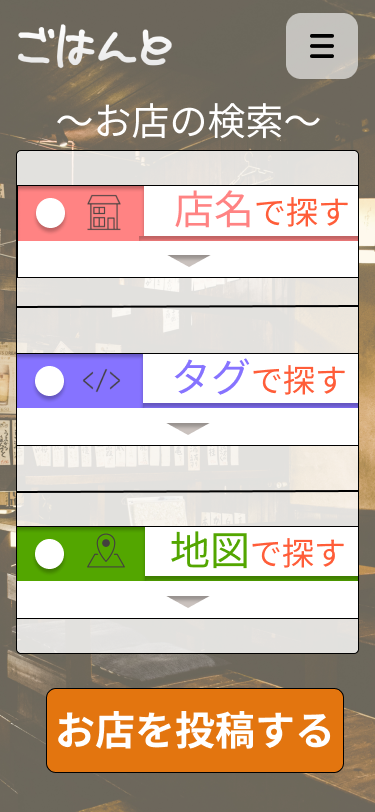

### 画面詳細図
## 情報変更
*****

*****

補足：対応DBの列はDB設計後、〇を対応するテーブル・カラム名に差し替えること。
| ID | 要素 | 内容 | アクション | イベント | 対応DB |
|----|-----|------|------------|-----------|-------|
|1|メインページ|メインページ表示|-|-|
|2|ハンバーガーメニューの表示|ボタン|ハンバーガーメニューの表示|-|
|3|検索（店舗名）|検索ボタン|タップ|入力欄をプルダウン|○|
|4|検索（タグ）|検索ボタン|タップ|タグ欄をプルダウン|○|
|5|検索（地図）|検索ボタン|タップ|地図をプルダウン|○|
|6|投稿ページ遷移ボタン|ボタン|タップ|投稿ページへ遷移|○|

