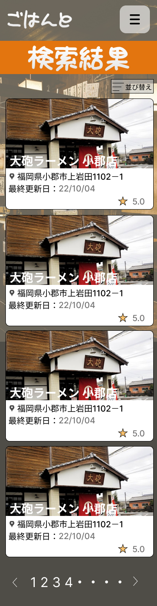

### 画面詳細図
## 情報変更
*****

*****

補足：対応DBの列はDB設計後、〇を対応するテーブル・カラム名に差し替えること。
| ID | 要素 | 内容 | アクション | イベント | 対応DB |
|----|-----|------|------------|-----------|-------|
|1|投稿ページ|投稿一覧ページ|-|-|-|
|2|ハンバーガーメニュー|ボタン|タップ|ハンバーガーメニューの表示|-|
|3|並べ替え|ボタン|タップ|並べ替えメニューの表示||
|4|投稿された店舗|画像ボタン|タップ|投稿された店舗の表示|○|
|5|前、次のページ|数字|タップ|ページ切り替え|○|
